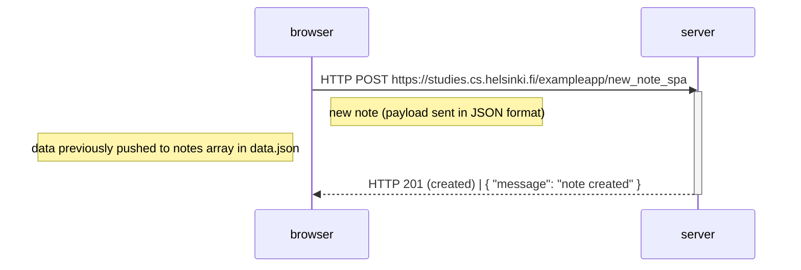

## Create note in SPA (Sequence diagram)

```mermaid
sequenceDiagram
    participant browser
    participant server


    browser->>server: HTTP POST https://studies.cs.helsinki.fi/exampleapp/new_note_spa
    activate server
    Note right of browser: new note (payload sent in JSON format)
    Note left of browser: data previously pushed to notes array in data.json
    server-->>browser: HTTP 201 (created) | { "message": "note created" }
    deactivate server
```